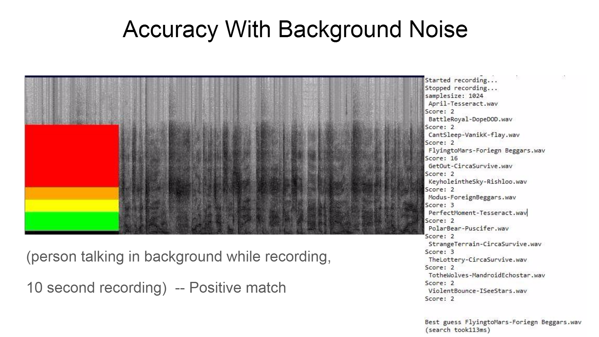

# Audio-Recognition
## Database Systems 4660 Project 2016 University of Lethbridge
*written by Tyler Churchill and Wyatt Trombley*

Libraries used:

LIBGDX (https://libgdx.badlogicgames.com/)

MUSICG (https://code.google.com/archive/p/musicg/downloads)

